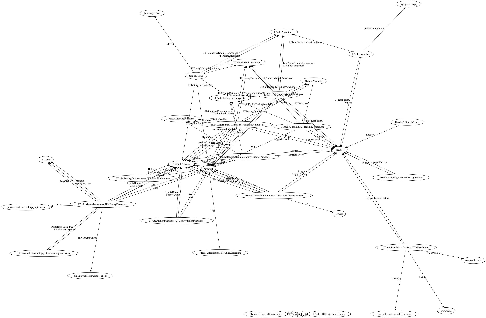

# Java Dependency Visualizer
View Dependencies in your Java Projects Visually




This tool is designed to help understand how large Java code-bases fit together.  It was originally developed to 
help in an effort to split a monolith Java project into smaller more manageable micro-services.

See example outputs of the tool in the examples/ folder

## Requirements
- Python 3 (Ubuntu: `sudo apt install python3` / Mac: `brew install python3`)
- The Python graphviz module `pip install graphviz`
- Graphviz (with the GTS module) installed on your machine (Mac: `brew install graphviz --with-gts`)

## Running the Tool
Standard usage is:
```bash
python3 class_visualizer.py --path [path to Java sources or the root of a project]
```
This command will analyse a path and create a graph `output.png` showing the dependencies of the project.


Options avaliable are:
- `--ignorefolders foldername1,foldername2` - Use this flag to ignore folders with a specific name (for example "Test" to exclude test sources)
- `--restrictclasses com.example,net.sw2g.int` - Use this flag to only analyse classnames that begin with a certain prefix.  For example, use com.example
to only analyse java sources that belong to the com.example.* packages and ignore all other dependencies.
- `--exporttree true` - Export the raw dependencies to a file (raw.out) to analyse yourself
- `--stats X` - Prints the top X classes that are referenced to
- `--findindependantclasses true` - Finds classes that have few outbound dependencies
- `--colormavenprojects true` - Will color nodes by Maven package
- `--invertedcolor true` - Inverts the graph (background is black, nodes are white)